# STM32 2 Board 스마트 도어락 완료보고서

정광근 · 개발기간 2026.07.23–2026.07.27

문서 작성 2026.09.12 사후 정리

## 1 프로젝트 개요

### 1.1 배경과 목적

여러 입력 장치와 출력 장치를 한 보드에 연결하는 실습에서 더 나아가, 인증을 수행하는 현관 단말과 상태를 확인하는 관리 콘솔을 분리하는 것을 목표로 삼았다. 인증 결과와 표시 장치의 물리적 위치가 달라지면 GPIO 동작만으로는 전체 상태를 전달할 수 없다. 이를 해결하기 위해 두 보드가 공통 명령 집합을 사용하고, UART 바이트 스트림을 패킷 단위로 해석하도록 구성했다.

BOARD_A는 사용자가 직접 조작하는 키패드와 RC522를 읽고 서보·LED·부저를 제어한다. BOARD_B는 인증 진행과 결과를 LCD에 표시하고, IR 리모컨에서 받은 잠금·해제 요청을 BOARD_A로 보낸다. 두 기능군을 나눔으로써 입력 처리, 상태 판단, 장치 구동, 원격 표시를 각각 설명하고 점검할 수 있는 구조를 만들었다. 근거: main.c:L196-L266, main.c:L298-L368.

### 1.2 구현 범위와 요구사항

| ID | 기능 요구 | 현재 구현과 확인 범위 |
| --- | --- | --- |
| FR01 | 키패드 비밀번호 입력 | 최대 3자리, # 확정, * 처리. 입력 모드별 취소 동작은 서로 다름 |
| FR02 | 일반 카드 구분 | RC522에서 얻은 4바이트 UID를 고정 목록과 비교 |
| FR03 | 관리자 비밀번호 변경 | 관리자 카드 진입 후 새 입력과 재입력을 비교하여 RAM 값 갱신 |
| FR04 | 도어 구동 | 키패드·일반 카드 성공 시 각도 90 호출 후 루프 대기와 각도 0 호출 |
| FR05 | 상태 피드백 | BOARD_A의 LED·부저, BOARD_B의 LCD 표시 |
| FR06 | 원격 잠금과 해제 | IR 32비트 코드 중 두 값을 LOCK 또는 UNLOCK 패킷에 연결 |
| FR07 | 보드 통신 | STX·CMD·LEN·DATA·XOR·ETX를 사용하는 송수신 |
| NFR01 | 보드별 펌웨어 생성 | BOARD_A 또는 BOARD_B 매크로를 선택해 같은 소스 묶음 빌드 |
| NFR02 | 오류 안내 | 비밀번호 실패 횟수 전달·LCD 오류 안내. 시간 기반 잠금은 없음 |
| NFR03 | 추적 가능한 산출물 | 현재 소스·빌드 로그·사진·보고서와 한계를 함께 보존 |

이 프로젝트의 완료 범위는 교육용 기능 통합 프로토타입이다. 카드 암호 인증, 비휘발성 자격정보 저장, 인증된 원격 채널, 동시 입력의 우선순위 보장, 오류 프레임으로부터의 완전한 복구는 현재 구현 범위에 포함되지 않는다.

### 1.3 개발 환경과 개인 역할

하드웨어는 최종 사진에서 확인되는 NUCLEO-F411RE 두 보드와 4×4 키패드, RC522 모듈, 16×2 문자 LCD, 소형 서보, 부저, LED, IR 수신부·리모컨이다. 펌웨어는 C와 시작 어셈블리로 구성되며 STM32F411xE CMSIS 헤더를 사용한다. 응용 드라이버는 GPIO·EXTI·SPI·I2C·USART·Timer 레지스터를 직접 설정하며 HAL API 호출을 사용하지 않는다.

정광근의 역할은 도어락 애플리케이션과 주변장치 통합으로 정리한다. 구체적으로 보드별 기능 분리, 키패드·RFID 상태 처리, UART 명령 연동, 서보·부저·LED와 LCD·IR의 연결을 설명할 수 있다. CMSIS·ST 제공 파일, 교육 기반 시작 코드와 공통 지원 코드를 활용했다.

## 2 프로젝트 관리와 개발 이력

### 2.1 주요 이력

| 구분 | 시점 | 내용 |
| --- | --- | --- |
| 개발 기간 | 2026.07.23-07.27 | 정광근의 STM32 두 보드 통합 프로젝트 |
| 최종 자료 | 2026.07.27 | 주요 소스 수정 시각과 관리자·입력·성공·실패·원격 화면 사진이 남음 |
| 현재 빌드 확인 | 2026.09.12 | 보존 원본과 공개용 사본의 BOARD_A·BOARD_B를 각각 새 격리 폴더에서 빌드 |

### 2.2 초기화 순서와 통합 관리

보드별 초기화는 공통 기반을 먼저 구성한 뒤 장치 드라이버와 링크를 연결한다. 두 보드 모두 Sys_Init에서 FPU 접근, 클록, USART2 디버그 출력과 LED 기본 설정을 준비한다. 장치 드라이버의 delay 함수가 클록 상수에 의존하므로 Clock_Init을 앞에 배치한다.

| 순서 | BOARD_A | BOARD_B |
| --- | --- | --- |
| 1 | Sys_Init(115200) | Sys_Init(115200) |
| 2 | 키패드 GPIO, LED3 | LED3, LCD I2C·화면 초기화 |
| 3 | TIM3 서보, TIM1 부저 | IR GPIO·TIM2·EXTI |
| 4 | RC522 SPI·reset·레지스터 | Link_Init(9600) |
| 5 | Link_Init(9600), 키패드 EXTI 허용 | 초기 LED와 대기 화면 |
| 6 | 잠금 각도, IDLE 전송, pending 초기화 | 수신 패킷·IR 이벤트 루프 |

BOARD_A는 IRQ를 켠 뒤 대기 상태를 만들고 키 pending을 지운다. BOARD_B는 LCD 초기화가 끝나야 IR·링크 초기화로 이동한다. 이 순서는 장치가 정상 응답할 때의 준비 흐름을 명확하게 해 주지만, 초기화 중 I2C나 SPI의 무제한 flag 대기에서 멈추면 뒤 단계까지 진행하지 못한다. 장치별 초기화 상태와 오류 반환을 추가하는 개선 과제로 연결된다. 근거: main.c:L34-L41, main.c:L196-L214, main.c:L298-L308.

## 3 시스템 아키텍처

### 3.1 보드별 데이터 흐름

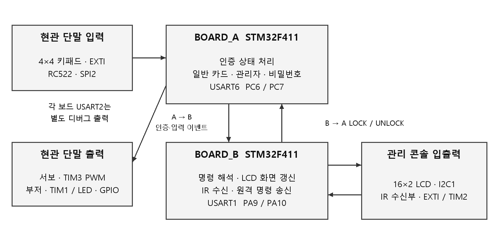

BOARD_A의 입력 경로는 키패드 인터럽트 이벤트와 RC522 폴링이다. 키패드는 인터럽트에서 눌린 열만 기록하고 메인 루프에서 행 스캔과 인증을 수행한다. RFID는 루프 횟수 카운터를 기준으로 UID를 읽는다. 인증 결과에 따라 로컬 출력을 바꾸고 BOARD_B에 이벤트 명령을 전달한다. 근거: exception.c:L15-L21, key.c:L70-L93, main.c:L216-L264.

BOARD_B의 입력 경로는 UART 수신 패킷과 IR 완료 이벤트이다. UART 명령을 해석해 LCD 화면을 갱신하고, IR 코드가 정해진 값이면 잠금·해제 패킷을 송신한다. 원격 화면은 명령을 보낸 직후 BOARD_B가 자체적으로 표시한다. 따라서 REMOTE UNLOCK 사진을 BOARD_A의 ACK 수신 또는 잠금장치 응답 성공의 증거로 해석하지 않는다. 현재 프로토콜에는 ACK가 없다. 근거: main.c:L312-L365.

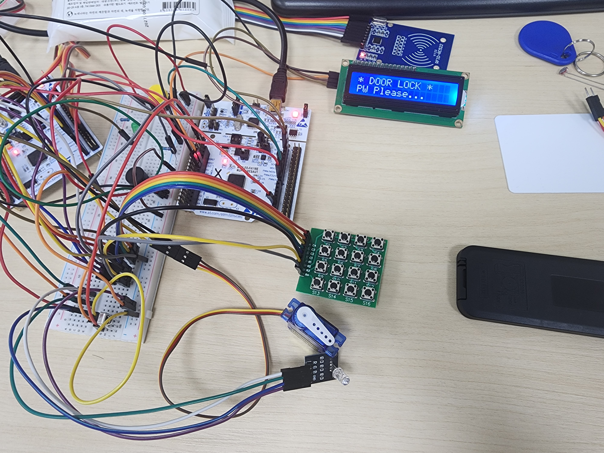

### 3.2 응용 및 장치 모듈

| 파일 | 주된 역할 | 실제 연결 또는 주의점 |
| --- | --- | --- |
| main.c | 보드 초기화, 인증 상태, 명령 처리, 표시 조합 | BOARD_A/B별 Main을 조건부 컴파일 |
| key.c | 키맵·행 GPIO·열 EXTI·행 스캔 | 입력 문자 필터는 없고 A-D도 키맵에 존재 |
| rfid.c | SPI2 바이트 전송, RC522 레지스터, REQA·anticollision | UID·BCC 확인, 고정 목록 비교는 main.c에서 수행 |
| uart_link.c | 프레임 송신, RX 인터럽트 파서, 완료 플래그 | 16바이트 임시 버퍼·8바이트 공개 데이터, LEN 검사 없음 |
| exception.c | EXTI·USART ISR 연결, 미처리 예외 진입 | 키패드 ISR은 이벤트만 전달, IR은 간격 처리 호출 |
| timer.c | TIM1 부저·TIM2 IR·TIM3 서보·TIM4/TIM5 대기 | 기능별 타이머가 분리되어 있으나 대기 호출은 블로킹 |
| lcd.c | I2C1, LCD 4비트 쓰기, 화면·커서 | I2C 이벤트를 polling하며 타임아웃 없음 |
| ir.c | PC10 EXTI, 간격 범위 판정, 32비트 코드 조립 | 완료 코드 1개만 보관, repeat frame 별도 처리 없음 |
| led.c | PA5-PA7 상태·점멸·진행 표시 | LED_Init은 PA5만 설정하고 main의 LED3_Init이 나머지 설정 |
| uart.c | USART2 디버그 송신과 baud 계산 | 보드 간 링크 USART6/1과 별도 |
| clock.c | HSI·PLL·AHB/APB 클록 설정 | 96 MHz 체계를 구성 |
| runtime.c | printf의 _write 연결, 기본 newlib syscall | UART2로 출력, 4 KiB 범위의 힙 보조 구현 |
| systick.c | SysTick 대기 보조 함수 | 보존 응용의 Main 경로에서는 호출하지 않음 |
| system_stm32f4xx.c | ST 공통 시스템 초기화·클록 갱신 함수 | 파일은 빌드에 포함되나 시작 경로는 별도 Clock_Init 사용 |

### 3.3 공통 기반 파일을 포함한 전체 구성

| 파일 | 역할 및 출처 경계 |
| --- | --- |
| crt0.s | 벡터 테이블, 초기 스택, 데이터 복사·BSS 초기화, Main 진입 |
| rom_0x08000000.lds | 512 KiB ROM과 128 KiB RAM, text/rodata/data/bss 배치 |
| Makefile | 도구 경로, 보드 매크로, 컴파일·링크·BIN/덤프 생성 |
| device_driver.h | 공통 장치 함수 선언과 헤더 결합 |
| option.h | SYSCLK/HCLK/PCLK/TIMXCLK와 힙·스택 관련 상수 |
| macro.h | 레지스터 비트·필드 쓰기와 읽기 매크로 |
| stm32f4xx.h | STM32 기종 선택과 공통 타입·설정 연결, ST 파일 |
| stm32f411xe.h | STM32F411 주변장치 주소·레지스터 구조·비트 정의, ST 파일 |
| system_stm32f4xx.h | SystemInit·SystemCoreClock 인터페이스, ST 파일 |
| core_cm4.h | Cortex-M4 코어·NVIC·SCB 등 CMSIS 접근 계층 |
| cmsis_compiler.h | 컴파일러별 CMSIS 연결 |
| cmsis_gcc.h | GCC용 intrinsic·컴파일러 지원 |
| cmsis_version.h | CMSIS 버전 선언 |
| mpu_armv7.h | ARMv7 MPU 정의·보조 함수 |

응용·장치·지원 C 파일 14개와 위 14개 구성 파일로 총 28개이다. 제3자 헤더에 남아 있는 저작권·라이선스 고지를 보존한다. 기반 파일의 존재 자체를 개인 구현 성과로 계산하지 않는다. 근거: Makefile:L31-L35, device_driver.h:L1-L63, crt0.s:L1-L374, rom_0x08000000.lds:L1-L64.

### 3.4 핀맵과 배선 관계

| 보드 | 기능 | MCU 핀 | 주변장치와 설정 |
| --- | --- | --- | --- |
| A | 키패드 R1-R4 | PA0, PA1, PA4, PA8 | GPIO open-drain 출력 |
| A | 키패드 C1-C4 | PB3, PB4, PB5, PB6 | pull-up 입력, falling EXTI3/4/5/6 |
| A | RC522 SCK | PB13 | SPI2 AF5 |
| A | RC522 MISO | PB14 | SPI2 AF5 |
| A | RC522 MOSI | PB15 | SPI2 AF5 |
| A | RC522 SS | PB2 | GPIO 소프트웨어 chip select |
| A | RC522 RST | PB1 | GPIO reset 출력 |
| A | 서보 신호 | PB0 | TIM3_CH3 AF2 |
| A | 부저 신호 | PA9 | TIM1_CH2 AF1 |
| A | 링크 TX / RX | PC6 / PC7 | USART6 AF8 |
| B | 링크 TX / RX | PA9 / PA10 | USART1 AF7 |
| B | LCD SCL / SDA | PB8 / PB9 | I2C1 AF4, open-drain·pull-up |
| B | IR 입력 | PC10 | EXTI10, falling edge, TIM2 간격 읽기 |
| A/B | LED 3채널 | PA5 / PA6 / PA7 | GPIO active-high 코드 |
| A/B | 디버그 TX / RX | PA2 / PA3 | USART2 AF7 |

UART 배선은 A의 TX PC6에서 B의 RX PA10으로, B의 TX PA9에서 A의 RX PC7으로 연결하는 관계이다. 두 보드는 공통 기준 전위를 가져야 한다. PA9라는 같은 번호가 나타나도 A의 부저와 B의 UART는 다른 MCU에 속하므로 직접 핀 충돌은 아니다. 반대로 A에서 부저와 USART1 TX를 동시에 PA9에 할당하면 같은 보드의 대체 기능 선택이 충돌한다.

RC_IRQ=12와 RFID_Irq 변수는 rfid.c에 남아 있으나 현재 RFID 처리에서 MCU 외부 IRQ 입력으로 사용되지 않는다. 현재 핀맵에서 RFID IRQ를 기능 경로에 포함하지 않는 이유이다. device_driver.h의 KEY_ROW_BASE 및 PA0-PA3 주석은 현재 ROW_PIN 배열과 맞지 않는다. 실제 행 배선 근거는 key.c의 배열과 GPIO 설정이다. 근거: key.c:L13-L31, key.c:L34-L68, rfid.c:L4-L6, rfid.c:L32-L53, timer.c:L88-L104, timer.c:L136-L146, uart_link.c:L22-L47, lcd.c:L8-L26, ir.c:L11-L27, uart.c:L8-L35.

## 4 상세 설계 및 구현

### 4.1 시작 코드와 클록 설정

시작 코드는 벡터 테이블의 초기 스택을 0x20020000으로 두고 __start로 진입한다. 이후 GPIOA·GPIOC 클록을 켜고 ST-LINK 관련 PA13·PA14 설정을 잠근 다음, ROM의 초기 데이터를 RAM으로 복사하고 BSS를 0으로 만든다. 마지막에 Main을 직접 호출한다. 이 시작 경로에는 SystemInit 또는 SystemCoreClockUpdate 호출이 없다. Main의 Sys_Init에서 FPU 접근을 허용하고 Clock_Init, Uart2_Init, 출력 버퍼 설정과 LED 기본 초기화를 수행한다. 근거: crt0.s:L7-L8, crt0.s:L315-L372, main.c:L34-L41.

clock.c는 HSI를 켜고 준비 상태를 기다린 뒤 PLL을 구성한다. 코드의 PLLM=8, PLLN=192, PLLP 인코딩 1 즉 분주 4, PLL 소스 HSI 설정을 적용한다. HSI 기준 16 MHz를 전제로 계산하면 16 MHz / 8 × 192 / 4 = 96 MHz이다. AHB는 분주 1, APB1은 분주 2, APB2는 분주 1이므로 HCLK=96 MHz, PCLK1=48 MHz, PCLK2=96 MHz가 된다. option.h의 상수도 이 관계와 일치한다. 이하 주파수와 시간 단위 계산은 해당 클록 설정을 전제로 한다. 근거: clock.c:L3-L19, option.h:L1-L5, system_stm32f4xx.c:L50-L55, system_stm32f4xx.c:L237-L265.

| 경로 | 설정에서 계산한 값 | 사용하는 기능 |
| --- | --- | --- |
| HSI | 16 MHz 전제 | PLL 입력 |
| PLL VCO | 384 MHz | 16 / 8 × 192 |
| SYSCLK/HCLK | 96 MHz | 코어·AHB |
| PCLK1 | 48 MHz | USART2, SPI2, I2C1 |
| PCLK2 | 96 MHz | USART1·USART6 |
| APB1 Timer 입력 | 96 MHz | TIM2·TIM3·TIM4·TIM5, option.h의 TIMXCLK |
| APB2 Timer 입력 | 현재 설정에서 96 MHz | TIM1. TIMXCLK를 재사용하므로 향후 APB 분주 변경 시 분리 계산 필요 |

현재 주요 불일치는 uart_link.c가 BRR 계산에 84,000,000을 직접 사용하고, lcd.c가 CR2=42, CCR=210, TRISE=43을 사용한다는 점이다. Link_Init(9600)은 코드의 호출값이지만, BRR은 8,750으로 계산된다. 실제 PCLK2가 위 설정대로 96 MHz라면 96,000,000 / 8,750 ≈ 10,971.43 baud가 되는 계산이다. 9,600 대비 약 14.29% 높은 계산값이다. 양쪽 링크가 같은 설정을 사용하면 서로 통신되는 현상과 설정 문서의 baud 불일치는 동시에 존재할 수 있다.

USART2는 PCLK1을 사용하므로 별도로 해석해야 한다. 48 MHz와 115,200 호출값에서 mantissa=26, fraction=1, BRR=0x1A1이 계산되고, 이론상 48,000,000 / 417 ≈ 115,107.91 baud이다. 보드 링크 문제를 근거로 디버그 UART도 같은 84 MHz 오류가 있다고 단정하지 않는다. 근거: uart_link.c:L40-L41, main.c:L198-L204, main.c:L300-L304, uart.c:L26-L35.

### 4.2 키패드의 인터럽트와 행 스캔

키패드는 4개 행과 4개 열의 조합으로 키를 식별한다. 행은 open-drain 출력이고 대기 시 모두 Low로 설정한다. 열은 pull-up 입력이다. 키가 눌리면 해당 열의 하강 에지가 발생하고 EXTI3, EXTI4 또는 EXTI9_5 핸들러가 열 번호를 전달한다. ISR은 Keypad_Event가 이미 설정되어 있으면 추가 이벤트를 무시하고, 첫 이벤트에 대해 열 번호를 기록한 뒤 열 EXTI 마스크를 잠시 끈다. 길이가 큰 인증 처리나 부저 동작을 ISR 안에서 수행하지 않는 구조이다. 근거: key.c:L15-L60, exception.c:L15-L21, exception.c:L36-L68.

메인 루프는 Keypad_Col이 0-3인지 확인한 뒤 Keypad_Scan을 호출한다. 스캔 함수는 모든 행을 해제 상태로 만든 다음 한 행씩 Low로 내리고, 고정 200회 루프 후 해당 열을 읽는다. Low가 유지되는 행을 찾으면 KEYMAP[row][col]을 반환한다. 반환 전 모든 행을 다시 Low로 만든다. 메인 루프는 키를 처리하고 나서 눌렸던 열이 High가 될 때까지 기다린 다음 pending 비트를 지우고 EXTI를 다시 허용한다. 근거: key.c:L70-L93, main.c:L245-L257.

이 방식은 길게 누른 한 번의 입력을 연속 입력으로 반복 처리하지 않도록 구성되어 있다. 다만 200회 루프는 시간 기준 디바운스 시험 결과가 아니며, 키 해제 대기는 블로킹이다. 다중 키 동시 입력, 고착된 키, 접점 바운스 빈도에 대한 측정 원자료는 없다. 키맵에 A-D가 있고 Handle_Key의 일반 입력 분기는 숫자를 별도로 확인하지 않으므로 문자 A-D도 입력 배열에 들어간다. 현재 입력 정책은 숫자 전용이 아니다.

Keypad_ISR_Enable(0)은 열 IMR을 끄고 IRQ9·10을 비활성화하지만 IRQ23을 비활성화하는 줄은 없다. 현재 Main은 enable=1만 호출한다. disable 경로를 재사용할 때 IRQ23 처리를 함께 정리할 필요가 있다. 근거: key.c:L62-L67, main.c:L137-L142.

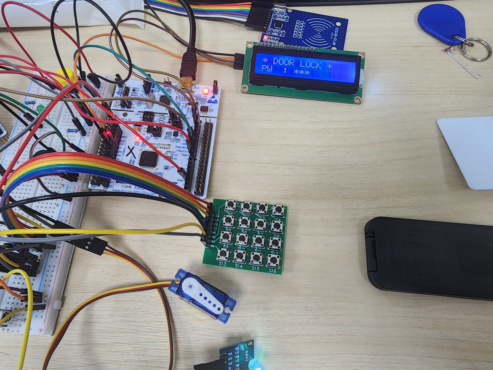

### 4.3 RC522와 SPI 통신

SPI2는 PB13-PB15를 AF5로 설정하고 PB2를 소프트웨어 SS, PB1을 reset 출력으로 사용한다. CR1은 master, 소프트웨어 slave management, 내부 NSS High와 BR=4를 설정한다. CPOL·CPHA·LSBFIRST·DFF를 별도로 세우지 않으므로 해당 쓰기값은 기본 8비트·MSB 우선·mode 0 구성을 의도한다. BR=4는 PCLK/32이므로 PCLK1=48 MHz 전제에서 SPI clock은 1.5 MHz 계산값이다.  근거: rfid.c:L35-L61. 비트 의미 보조 출처: ST RM0383의 SPI_CR1 설명.

RC_Write는 SS를 내리고 ((주소<<1)&0x7E), 데이터 순서로 전송한 뒤 SS를 올린다. RC_Read는 주소 바이트의 bit7을 세우고 dummy 0x00을 송신하면서 반환 바이트를 읽는다. SPI2_Byte는 TXE를 기다려 DR에 쓴 뒤 RXNE를 기다려 DR을 읽는다. 이 하위 함수에는 기다림의 시간 제한이나 오류 반환이 없다. 상위 RC_Comm의 반복 횟수 제한이 있어도 하위 SPI 플래그에서 멈추면 빠져나오지 못한다는 점을 구분해야 한다. 근거: rfid.c:L55-L89.

초기화는 reset Low, TIM5_Delay(10), reset High, 50 지연, SoftReset 명령, 다시 50 지연 순서이다. 이후 RC522의 timer·ASK·Mode 레지스터를 쓰고 안테나 제어 하위 두 비트가 켜져 있지 않으면 켠다. 마지막에 VersionReg를 디버그 UART로 출력한다. RC_IRQ 상수는 정의되어 있지만 현재 RC522 드라이버는 MCU IRQ 대신 레지스터 polling으로 상태를 확인한다. 근거: rfid.c:L91-L114.


RC522 레지스터 쓰기와 읽기의 실제 구현은 다음과 같다. 주소의 read bit와 SS 구간을 상위 명령 처리에서 숨겨 동일한 레지스터 접근 함수로 사용한다.

```c
static void RC_Write(unsigned char addr, unsigned char val)
{
	Macro_Clear_Bit(GPIOB->ODR, RC_SS);
	SPI2_Byte((addr << 1) & 0x7E);
	SPI2_Byte(val);
	Macro_Set_Bit(GPIOB->ODR, RC_SS);
}

static unsigned char RC_Read(unsigned char addr)
{
	unsigned char v;
	Macro_Clear_Bit(GPIOB->ODR, RC_SS);
	SPI2_Byte(((addr << 1) & 0x7E) | 0x80);
	v = SPI2_Byte(0x00);
	Macro_Set_Bit(GPIOB->ODR, RC_SS);
	return v;
}
```

근거: rfid.c:L63-L79.

### 4.4 UID 읽기와 오류 처리

RFID_Read_UID는 먼저 BitFramingReg를 0x07로 설정하고 REQA 0x26을 보낸다. RC_Comm이 성공하고 응답 길이 bits가 0x10 즉 16비트인지 확인한 뒤, BitFramingReg를 0으로 바꾸고 0x93·0x20 두 바이트를 보내 anticollision 응답을 받는다. 응답의 앞 4바이트를 UID에 복사하면서 XOR하고 다섯 번째 바이트와 비교해 BCC를 검사한다. 카드 목록과의 권한 비교는 이 함수 안이 아니라 main.c의 Card_Check가 담당한다. 근거: rfid.c:L156-L175, main.c:L73-L82.

RC_Comm은 FIFO를 비우고 명령을 IDLE로 만든 뒤 송신 데이터를 FIFO에 적재한다. TRANSCEIVE 명령과 StartSend 비트를 설정한 후 ComIrqReg를 읽으며 최대 2,000회 반복한다. 반복이 끝나거나 ErrorReg의 선택한 비트가 있으면 실패를 반환한다. 수신된 FIFO 데이터를 최대 16바이트까지 복사하며 응답 비트 수를 계산한다. 2,000은 루프 횟수이므로 “2,000 ms timeout”으로 바꾸지 않는다. 근거: rfid.c:L116-L153.

REQA 응답 길이는 검사하지만 anticollision 응답이 최소 5바이트인지 또는 40비트인지 별도로 검사하지 않는다. RC_Comm이 성공으로 반환한 짧은 응답에서 buf[4]를 읽는 경로가 남는다. FIFO 수신 길이를 16으로 제한하는 처리와 프로토콜별 최소 길이 검사는 서로 다른 조건이다. 개선 시 두 조건을 함께 검증해야 한다. 7바이트·10바이트 UID의 cascade 처리, 카드 SELECT·암호 인증·카드 메모리 접근은 이 코드 범위에 없다.

BOARD_A의 rfid_tick은 메인 루프가 3,000회 돌 때마다 0으로 돌아가며 읽기 함수를 호출한다. 밀리초 주기 타이머가 아니다. `RFID_Read_UID(uid) && state == ST_IDLE`은 읽기 함수가 먼저 평가되므로 관리자 입력 중에도 SPI 통신을 수행하고, 인증 상태 전이만 ST_IDLE 조건으로 제한한다. 등록되지 않은 UID는 Card_Check에서 -1을 반환해 화면·부저 분기 없이 지나간다. 근거: main.c:L214-L243.

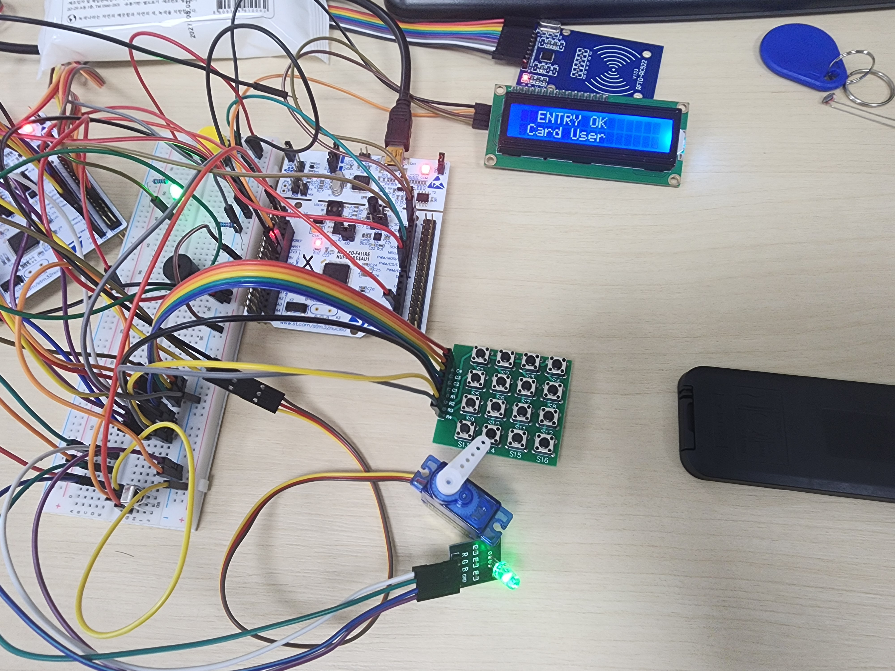

### 4.5 서보 PWM과 자동 닫힘

TIM3_CH3는 PB0를 AF2로 설정하고 1 MHz timer tick을 목표로 prescaler를 계산한다. TIMXCLK=96 MHz 전제에서 PSC=95, ARR=19,999이다. CCR3 초기값은 1,500이며 Set_Angle은 0-180 범위로 값을 제한한 후 500 + 2,000×angle/180을 계산한다. 따라서 코드 호출값 0, 90, 180은 각각 500, 1,500, 2,500 count로 매핑된다.  근거: timer.c:L16-L20, timer.c:L88-L114.

| 각도 인자 | CCR3 계산 | 1 MHz tick을 전제로 한 명목 pulse |
| --- | --- | --- |
| 0 | 500 | 약 0.5 ms |
| 90 | 1,500 | 약 1.5 ms |
| 180 | 2,500 | 약 2.5 ms |
| 범위 밖 | 0 또는 180으로 제한 | 기구 안전 범위를 측정해 보장한 것은 아님 |

키패드 성공 시 LED_Set과 Buzzer_OK를 먼저 실행하고 서보 각도 90을 호출한다. 이후 PW_OK를 보내고 실패 카운터를 초기화한 뒤 20,000,000회 volatile 루프를 기다려 각도 0과 Go_Idle을 호출한다. 일반 카드 성공도 같은 크기의 루프 후 닫힘을 호출하지만 실패 카운터 초기화 줄은 없다. 반면 원격 UNLOCK은 각도 90만 호출하고 자동 닫힘을 예약하지 않는다. 근거: main.c:L114-L123, main.c:L232-L240, main.c:L259-L263.

volatile 루프는 최적화에서 완전히 사라지지 않도록 작성된 대기이지만 시간을 보장하는 스케줄러는 아니다. 컴파일 옵션·클록·인터럽트 부하에 따라 경과 시간이 달라질 수 있으므로 일정한 3초 또는 5초 자동 닫힘으로 환산하지 않는다. 별도 타이머 기한과 상태 전이를 사용하는 개선안이 필요하다.


서보 각도 인자에서 비교값을 만드는 함수이다. 범위 제한과 선형 변환을 한곳에 두어 인증·원격 경로가 같은 PWM 인터페이스를 사용한다.

```c
void TIM3_Servo_Set_Angle(int angle)
{
	if(angle < 0)   angle = 0;
	if(angle > 180) angle = 180;

	TIM3->CCR3 = SERVO_MIN_US
	           + (SERVO_MAX_US - SERVO_MIN_US) * angle / 180;
}
```

근거: timer.c:L107-L114.

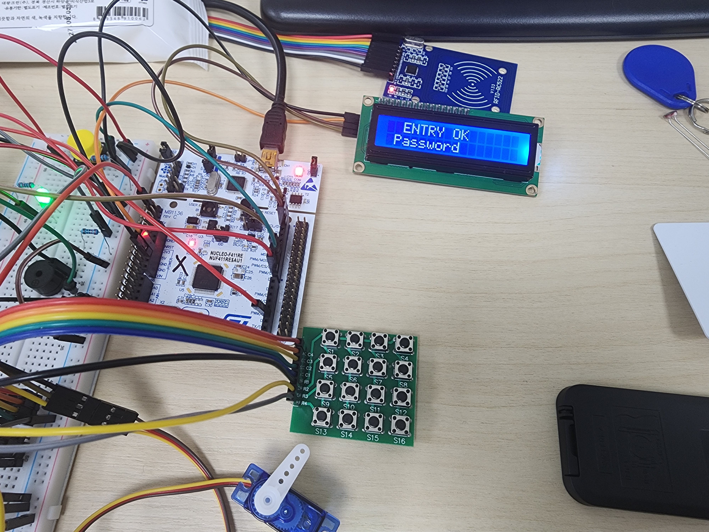

### 4.6 부저와 LED 피드백

부저는 TIM1_CH2와 PA9 AF1을 사용한다. 일반 timer와 달리 TIM1 출력 경로에는 BDTR의 MOE bit를 켠다. 주파수 함수는 8 MHz 카운터 목표에서 PSC를 계산하고 ARR=8,000,000/freq-1, CCR2=ARR/2로 설정한다. 따라서 약 50% duty의 음정 출력을 의도한다.  정지는 CCR2=0과 CEN clear로 수행한다. 근거: timer.c:L136-L163.

| 입력 사건 | 음 패턴의 코드 | TIM4_Delay 호출값 합 |
| --- | --- | --- |
| 키 입력 | C2 | 40 |
| 인증 성공 | C2, E2, G2 | 100 + 100 + 200 = 400 |
| 실패 | G1, D1 | 150 + 300 = 450 |
| 관리자 카드 | G2, C2, G2 | 80 + 80 + 80 = 240 |

표의 지연 합은 코드가 전달하는 ms 인자의 합이다. 전체 인증 응답 시간이나 관측된 부저 재생 시간을 뜻하지 않는다. Buzzer_Beep가 TIM4_Delay를 동기 호출하기 때문에 부저가 끝날 때까지 Main의 다음 작업은 진행하지 못한다. 인터럽트가 계속 동작하더라도 메인 루프의 RFID·명령 처리는 뒤로 밀릴 수 있다. 근거: main.c:L56-L71, timer.c:L116-L121.

LED는 PA5·PA6·PA7을 active-high로 제어한다. LED_Progress는 입력 길이에 따라 앞 채널부터 켜고, LED_Blink는 지정 mask를 켠 뒤 TIM5_Delay(ms), 끈 뒤 같은 지연을 반복한다. 세 번·200 인자를 사용하는 비밀번호 오류 경로는 명목 지연 인자만 합하면 1,200 ms이며 부저 지연은 별도로 앞에 있다.  LED_Init은 PA5만 출력으로 설정하고, 각 보드 Main은 LED3_Init을 추가 호출해 PA5-PA7을 설정한다. 근거: led.c:L7-L49, main.c:L43-L52, main.c:L129-L131.

### 4.7 타이머 자원과 블로킹 구간

| Timer | 용도 | 핵심 설정과 호출 방식 |
| --- | --- | --- |
| TIM1 | 부저 PWM | 8 MHz 목표 tick, 주파수별 ARR, 약 절반 CCR2 |
| TIM2 | IR 에지 간격 | 1 MHz 목표 tick, ARR=0xFFFFFFFF, ISR에서 CNT 읽고 0으로 재설정 |
| TIM3 | 서보 PWM | 1 MHz 목표 tick, ARR=19,999, CCR3 각도 매핑 |
| TIM4 | 부저 길이 등 지연 | 50 kHz 목표 tick, ARR=50×time-1, flag polling |
| TIM5 | RFID·LCD·LED의 지연 | 1 MHz 목표 tick, ARR=1,000, one-pulse를 ms 횟수만큼 반복 |
| SysTick | 지원 함수만 존재 | 현재 Main 경로에서 호출하지 않음 |

TIM4_Delay는 Repeat → Check_Timeout 반복 → Stop으로 구성된다. 보존 소스에는 세 helper의 정의가 모두 있으며 현재 링크가 성공했다.  TIM5는 ARR=1,000이므로 엄밀한 주기 계산에서 ARR+1과 루프·호출 오버헤드를 고려해야 한다. 따라서 “정확한 1 ms 지연”이라고 보장하지 않는다. 근거: timer.c:L28-L55, timer.c:L116-L133, timer.c:L165-L180, systick.c:L1-L29.

타이머 번호를 나눠 레지스터 설정 충돌을 줄인 점과 비블로킹 스케줄링은 구분해야 한다. 현재 LCD I2C 전송, SPI flag 대기, 키 해제 대기, 부저 재생, LED 점멸, 서보 유지 루프는 Main 진행을 막는다. 단일 완료 플래그를 사용하는 통신·IR과 함께 운용할 때 연속 이벤트가 유실되거나 표시가 늦어질 수 있는 구조이다.

### 4.8 IR 수신과 원격 명령

IR 입력 PC10은 pull-up GPIO 입력이며 falling edge EXTI10에 연결된다. TIM2는 명목 1 us tick으로 자유 실행한다. EXTI15_10 핸들러는 PC10 pending을 확인하고 지운 뒤 IR_Edge_ISR을 호출한다. ISR은 CNT를 gap으로 읽고 CNT를 0으로 만들어 다음 하강 에지까지의 간격을 측정한다. 하강 에지 사이의 주기를 측정한다. 근거: ir.c:L11-L33, exception.c:L25-L34, timer.c:L123-L133.

| gap 조건 | 처리 |
| --- | --- |
| 12,000 < gap < 15,000 | leader로 간주하고 버퍼 0, 비트 수 0으로 초기화 |
| 1,800 < gap < 2,700 | bit 1. 기존 버퍼를 오른쪽으로 옮긴 뒤 bit31을 세움 |
| 800 < gap < 1,500 | bit 0. 오른쪽 이동만 유지 |
| 그 외 데이터 간격 | 수신 중단, ir_cnt=-1 |
| 32비트 완료 | IR_Ready가 비어 있으면 IR_Data와 완료 플래그 설정 |

모든 범위는 부등호가 strict이므로 경계값 그 자체는 허용 범위에 포함되지 않는다. 버퍼 조립 방식은 각 비트를 오른쪽으로 옮겨 최종 32비트 값을 만드는 방식이다. 주소와 명령의 보수 관계를 검증하거나 NEC repeat frame을 별도로 처리하는 코드가 없다. 따라서 “NEC 전체 규격 구현”보다 “NEC 형태의 간격 기반 32비트 수신과 두 코드 매핑”이라고 기술한다. 근거: ir.c:L35-L60.

Main은 IR_To_Key가 반환한 1을 UNLOCK, 2를 LOCK에 연결한다. 완료 플래그가 이미 차 있으면 다음 완료 코드는 보관하지 않는다. LCD의 REMOTE 화면은 이 송신 분기에서 직접 출력하고 IR_Ready를 지운다. 상대 보드가 실제 명령을 처리했는지 알리는 확인 메시지는 없다. 근거: main.c:L28-L29, main.c:L277-L282, main.c:L360-L365.

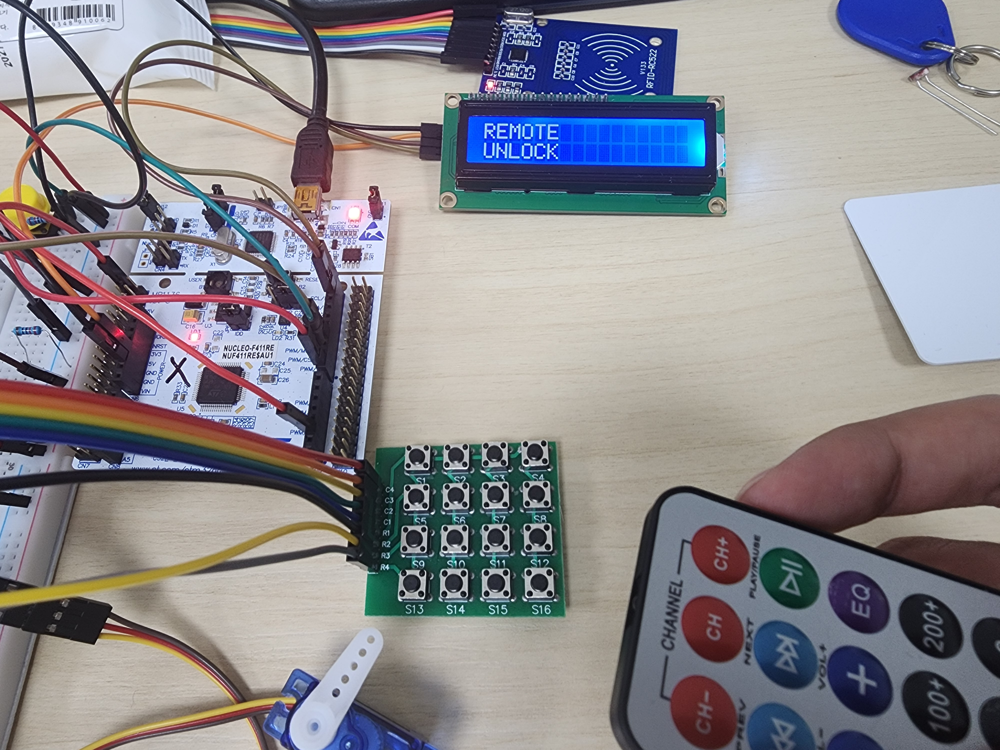

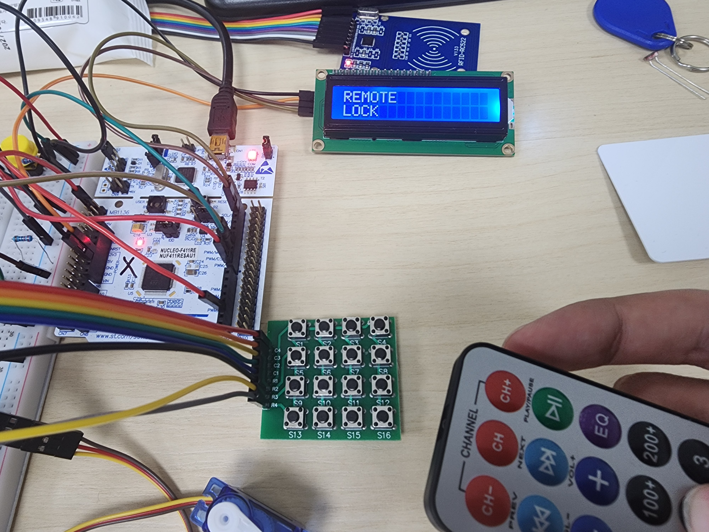

### 4.9 LCD의 I2C와 4비트 쓰기

LCD는 PB8·PB9의 I2C1을 사용한다. 7비트 주소 상수 0x27을 왼쪽으로 한 비트 이동한 값을 전송한다. GPIO는 AF4·open-drain·pull-up으로 설정한다. I2C_Send는 bus busy 해제를 기다리고 START, SB 확인, 주소 쓰기, ADDR 확인과 SR2 읽기, TXE 확인, 데이터 쓰기, BTF 확인, STOP 순서를 수행한다. 각 바이트마다 하나의 I2C transaction을 수행하며 NACK·bus error·타임아웃을 반환하는 인터페이스는 없다. 근거: lcd.c:L3-L6, lcd.c:L8-L45.

I2C 설정의 CR2=42, CCR=210, TRISE=43은 42 MHz 주변 클록을 기준으로 한 구성이지만 현재 PCLK1 계산은 48 MHz이다. Standard mode의 단순 CCR 식을 적용하면 48 MHz/(2×210)≈114.29 kHz가 된다. 이 계산은 CCR 기준이며 rise time과 배선에 따른 실제 파형은 별도 측정 대상이다. CCR뿐 아니라 CR2와 TRISE도 실제 PCLK에 맞춰 함께 점검해야 한다. 근거: lcd.c:L22-L26, option.h:L1-L5. 수식 보조 출처: ST RM0383 I2C_CCR 설명.

L_Nibble은 상위 4비트 데이터에 backlight·RS bit를 결합하고 EN을 올려 쓴 후 내려 쓴다. L_Write는 상위 nibble과 하위 nibble을 순서대로 보낸다. 명령은 RS=0, 문자는 RS=1을 사용하며, LCD_Goto는 첫 줄 0x00 또는 둘째 줄 0x40의 DDRAM 주소를 선택한다. 초기화는 0x30 nibble 세 번, 0x20 nibble, 0x28·0x08·0x01·0x06·0x0C 명령을 순서대로 실행한다. 근거: lcd.c:L47-L110.

보드별 사용자 화면은 lcd.c가 아니라 main.c의 LCD_Show와 Show_Input에 정의된다. Show_Input은 실제 입력 문자를 보내지 않고 mode와 입력 길이로 별표·밑줄을 만든다. 그러나 이는 입력 진행 패킷만의 특성이다. 비밀번호 변경 완료 명령은 새 비밀번호 3바이트를 전송하고 BOARD_B가 디버그 UART로 출력하므로, 입력 진행 패킷과 비밀번호 변경 패킷의 정보 범위가 다르다. 근거: main.c:L91-L95, main.c:L177-L180, main.c:L284-L295, main.c:L337-L340.

### 4.10 인증 상태 머신의 정확한 동작

애플리케이션 상태는 ST_IDLE, ST_ADMIN_NEW1, ST_ADMIN_NEW2 세 개이다. input은 일반·재확인 입력을, newpw는 첫 관리자 입력을, idx는 현재 입력 길이를 저장한다. fail은 일반 비밀번호 실패 횟수이며 Go_Idle은 state와 idx 및 LED만 초기화하고 fail을 초기화하지 않는다. 암호 배열은 RAM의 정적 배열이다. 근거: main.c:L84-L102.

| 현재 상태 | 사건과 조건 | 다음 상태와 동작 |
| --- | --- | --- |
| ST_IDLE | 일반 문자, idx<3 | input에 저장, 키음·LED 진행·PW_INPUT(mode0, idx) |
| ST_IDLE | 일반 문자, idx=3 | 추가 문자를 저장하지 않음 |
| ST_IDLE | * | idx=0, 키음, PW_INPUT(mode0,0). LED 진행 초기화 호출은 없음 |
| ST_IDLE | # 및 3자리 일치 | 성공음·LED, 각도90, PW_OK, fail=0, 루프 대기, 각도0, Go_Idle |
| ST_IDLE | # 및 길이 부족 또는 불일치 | fail 증가, 실패음·점멸, PW_FAIL, 3이면 fail=0, Go_Idle |
| ST_IDLE | 관리자 UID | ST_ADMIN_NEW1, idx=0, 관리자 알림, ADMIN 패킷 |
| ST_IDLE | 일반 등록 UID | 서보 개방·ENTER·루프 대기·닫힘·Go_Idle. fail은 유지 |
| ST_ADMIN_NEW1 | 문자, idx<3 | newpw에 저장, PW_INPUT(mode1, idx) |
| ST_ADMIN_NEW1 | # 및 idx=3 | ST_ADMIN_NEW2, idx=0, 재확인 화면 |
| ST_ADMIN_NEW1 | # 및 idx<3 | 실패음만 내고 현재 상태·입력 유지 |
| ST_ADMIN_NEW1 | * 및 idx>0 | 입력 길이 0, 새 입력 화면 유지 |
| ST_ADMIN_NEW1 | * 및 idx=0 | 실패음 후 Go_Idle |
| ST_ADMIN_NEW2 | 문자, idx<3 | input에 재확인 값 저장, PW_INPUT(mode2, idx) |
| ST_ADMIN_NEW2 | * | 재확인 입력 길이 0, 해당 상태 유지 |
| ST_ADMIN_NEW2 | # 및 두 입력 일치 | PASSWORD 갱신, 성공음·PWCHG, 루프 대기 후 Go_Idle |
| ST_ADMIN_NEW2 | # 및 불일치·길이 부족 | 실패음, 루프 대기 후 Go_Idle. 기존 PASSWORD 유지 |

관리자 취소는 상태에 따라 다르므로 * 한 번이면 언제나 전체 취소된다고 안내하면 안 된다. ST_ADMIN_NEW1에서 이미 문자를 입력했다면 첫 *는 지우기이며, 비어 있는 상태에서 다시 *를 입력해야 대기로 돌아간다. ST_ADMIN_NEW2의 *는 재확인 입력만 지운다. 재확인에서 #으로 불일치를 확정하면 기존 비밀번호를 바꾸지 않고 대기로 복귀한다. 근거: main.c:L104-L194.

현재 비밀번호 길이는 3이지만 숫자 전용으로 제한하지 않는다. 비밀번호를 변경해도 비휘발성 저장을 하지 않으므로 리셋 후 초기 배열 값으로 돌아간다. 일반 비밀번호 실패가 3이 되면 BOARD_B에 3을 보낸 뒤 BOARD_A 내부 fail을 0으로 만든다. 시간 경과에 따른 잠금 상태, 입력 금지, 재시도 지연을 유지하는 분기는 없다.

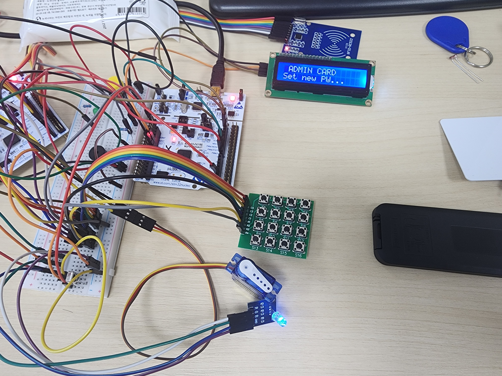

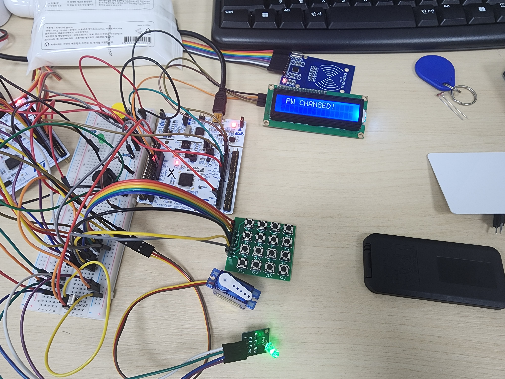

### 4.11 UART 명령과 데이터 규약

프레임은 STX(02), CMD, LEN, DATA[LEN], XOR checksum, ETX(03) 순서이다. 길이가 0이면 DATA가 없으므로 전체 길이는 5바이트이고, 데이터가 N바이트면 N+5바이트이다. Checksum은 CMD와 LEN을 XOR한 값에 데이터 바이트를 차례로 XOR한다. STX와 ETX는 checksum 계산에 포함하지 않는다. 근거: uart_link.c:L9-L20, uart_link.c:L56-L70.

| 방향 | 명령 | 값 | 송신 코드의 LEN | DATA와 의미 |
| --- | --- | --- | --- | --- |
| A→B | ENTER | 01 | 4 | 일반 카드 UID. 비밀번호 성공 명령과 다름 |
| A→B | ADMIN | 02 | 4 | 관리자 카드 UID |
| A→B | PWCHG | 03 | 3 | 변경한 비밀번호 3바이트 |
| A→B | PW_OK | 04 | 0 | 비밀번호 성공 |
| A→B | PW_FAIL | 05 | 1 | 실패 횟수 |
| A→B | PW_INPUT | 06 | 2 | mode(0 일반, 1 새 값, 2 확인), 입력 개수 |
| A→B | IDLE | 07 | 0 | 대기 화면 요청 |
| B→A | LOCK | 10 | 0 | 서보 각도0 호출 요청 |
| B→A | UNLOCK | 11 | 0 | 서보 각도90 호출 요청 |

키패드 성공은 PW_OK, 일반 카드 성공은 ENTER를 사용하여 콘솔이 출입 수단을 구분한다. 또한 송신 측이 사용하는 LEN과 수신 측이 검증하는 LEN을 구분해야 한다. 위 표는 송신 분기에서 확인한 규약이며, 수신 파서와 main은 명령별 길이를 검사하지 않는다. 근거: main.c:L4-L12, main.c:L91-L101, main.c:L114-L131, main.c:L177-L180, main.c:L225-L237, main.c:L363-L364.


송신 함수는 프레임 포맷을 한곳에서 구성한다. 호출자는 명령과 payload만 전달하며, 길이가 0이면 data 포인터를 역참조하지 않는다.

```c
void Link_SendPacket(unsigned char cmd, const unsigned char *data, unsigned char len)
{
	unsigned char chk = cmd ^ len;

	Link_SendByte(STX);
	Link_SendByte(cmd);
	Link_SendByte(len);
	for(int i = 0; i < len; i++)
	{
		Link_SendByte(data[i]);
		chk ^= data[i];
	}
	Link_SendByte(chk);
	Link_SendByte(ETX);
}
```

근거: uart_link.c:L56-L70.

### 4.12 XOR 프레임 계산 예

아래 표는 Link_SendPacket의 코드 연산을 적용한 계산 예이다. 인증 값을 사용하지 않고 명령과 입력 길이만으로 프레임 구성을 설명한다.

| 예제 | 계산 | 완성 프레임 |
| --- | --- | --- |
| 잠금 | 10 XOR 00 = 10 | 02 10 00 10 03 |
| 해제 | 11 XOR 00 = 11 | 02 11 00 11 03 |
| 일반 입력 2자리 | 06 XOR 02 XOR 00 XOR 02 = 06 | 02 06 02 00 02 06 03 |
| 일반 비밀번호 3번째 실패 | 05 XOR 01 XOR 03 = 07 | 02 05 01 03 07 03 |

세 번째 예제의 payload에는 02, 마지막 예제에는 03이 포함된다. 현재 프로토콜은 데이터 안의 STX·ETX 값을 escape하지 않는다. 대신 LEN으로 데이터 구간을 결정하기 때문에 정상 길이의 프레임에서는 해당 값이 데이터로 처리된다. 따라서 payload에 02 또는 03이 있다는 이유만으로 항상 framing 오류가 나는 것은 아니다. LEN이 잘못되거나 바이트가 유실될 때 복구가 어려운 문제가 별도로 남는다.

XOR은 전송 중 일부 오류를 검출할 수 있지만 데이터의 순서가 바뀌거나 여러 비트 오류가 상쇄되면 같은 결과가 나올 수 있다. Checksum이 맞다는 사실만으로 발신자 인증이나 보안성을 제공하지 않는다. CRC·ACK·sequence·인증은 목적이 다른 기능이므로 개선 요구에서 구분한다. 근거: uart_link.c:L56-L70, uart_link.c:L88-L115.

### 4.13 수신 파서의 상태 전이

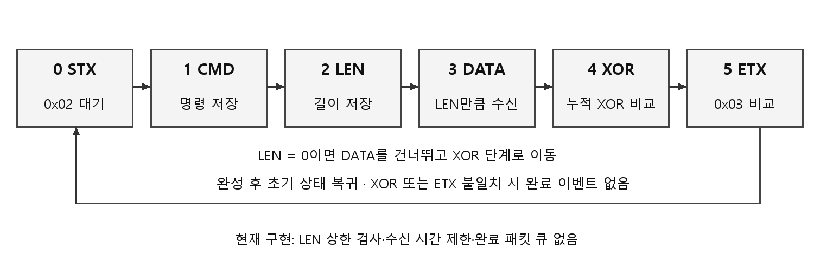

| rx_state | 기다리는 입력 | 동작과 다음 상태 |
| --- | --- | --- |
| 0 | STX | b==02이면 checksum을 0으로 하고 상태1 |
| 1 | CMD | rx_buf[0]=b, checksum=b, 상태2 |
| 2 | LEN | rx_buf[1]=b, checksum XOR, idx=0, LEN>0이면3 아니면4 |
| 3 | DATA | rx_buf[2+idx] 저장·checksum XOR, LEN만큼 받으면4 |
| 4 | XOR | 수신값과 계산값 일치하면5, 아니면0 |
| 5 | ETX | ETX 일치 및 완료 플래그가 비어 있으면 데이터를 공개하고 ready=1. 이후0 |

“일반 입력 2자리”의 7바이트 예를 따라가면 02에서 상태1, 06에서 상태2, LEN=02에서 상태3, 데이터 00과 02를 받은 뒤 상태4, checksum 06에서 상태5, 마지막 03에서 완료된다. 상태3에서는 STX 값도 데이터이므로 두 번째 데이터 02가 수신 시작으로 오인되지 않는다. 이 설명은 코드 추적이다. 근거: uart_link.c:L72-L118.

수신 저장 공간은 rx_buf[16]이고 그중 처음 두 바이트가 CMD·LEN이다. 따라서 이 배열 안에서 사용할 수 있는 payload는 최대 14바이트이다. 전달 공간 Link_Data는 8바이트이므로 전체 경로의 안전 상한은 8바이트이다. 현재 LEN의 상한을 검사하지 않아 LEN 9-14는 임시 버퍼에 들어갈 수 있어도 최종 복사에서 Link_Data 범위를 넘을 수 있고, LEN 15 이상은 임시 저장 중에도 범위를 넘을 수 있다. 

LEN을 8 이하로만 제한해도 모든 문제가 해결되는 것은 아니다. PW_INPUT을 LEN=0으로 받은 경우 main은 Link_Data[0]과 [1]을 읽기 때문에 이전 패킷 데이터가 남아 있으면 잘못된 입력 화면을 만들 수 있다. 명령마다 예상 길이를 확인해야 한다. 체크섬이 틀린 경우 상태0으로 돌아가지만 실패한 현재 바이트를 새 STX로 재사용하지 않는다. 중간 프레임이 끊기면 시간 제한 없이 해당 상태에 머무른다. 근거: uart_link.c:L13-L20, uart_link.c:L88-L115, main.c:L316-L318.

완료 플래그는 큐가 아니라 하나의 보관 슬롯이다. 앞선 패킷을 Main이 처리하기 전에 다음 프레임이 완료되면 `!Link_Packet_Ready` 조건 때문에 새 패킷은 전달하지 않는다. Main이 긴 부저·LED·키 해제·LCD 대기를 수행할 때 연속 명령을 보장할 수 없는 이유이다. UART IRQ에서 NVIC pending을 지우는 동작과 큐의 역할을 혼동하지 않는다. 근거: uart_link.c:L106-L115, exception.c:L72-L76, main.c:L357-L357.


수신 파서의 checksum·종료 처리 부분이다. 정상 종료 조건과 단일 완료 슬롯 정책을 동시에 볼 수 있다.

```c
		case 4:	
			if(b == rx_chk) rx_state = 5;
			else            rx_state = 0;	
			break;

		case 5:	
			if(b == ETX && !Link_Packet_Ready)
			{
				Link_Cmd = rx_buf[0];
				Link_Len = rx_buf[1];
				for(int i = 0; i < Link_Len; i++)
					Link_Data[i] = rx_buf[2 + i];
				Link_Packet_Ready = 1;
			}
			rx_state = 0;
			break;
```

근거: uart_link.c:L101-L116.

### 4.14 보드 간 전체 시나리오

비밀번호 입력 시 BOARD_A가 키 한 개를 처리할 때마다 PW_INPUT(mode0, 입력 길이)를 보낸다. BOARD_B는 별표 개수를 갱신한다. # 확정에 성공하면 A가 로컬 알림과 서보를 처리하고 PW_OK를 보내며 B는 ENTRY OK / Password를 표시한다. A가 루프 대기 후 닫힘을 호출하고 IDLE을 보내면 B는 초기 화면을 그린다. 정상 시나리오는 각각의 코드 분기로 추적 가능하지만, 각 메시지가 실제로 빠짐없이 전달되었는지는 별도 통신 시험이 필요하다.

관리자 카드는 ADMIN으로 관리 화면을 시작한다. 이후 첫 입력은 mode1, 재확인은 mode2의 PW_INPUT으로 표시된다. 일치하면 A가 RAM 값을 갱신하고 PWCHG를 보낸다. B는 PW CHANGED!를 표시하며 디버그 출력에는 전달된 변경 값도 들어간다. 최종 사본은 예제값을 사용하지만 해당 평문 전달 구조 자체는 수정하지 않았다.

원격 제어에서는 B가 IR 완료 값을 읽어 UNLOCK 또는 LOCK을 보내고 즉시 REMOTE 화면을 표시한다. A는 수신 플래그를 처리하는 시점에 각도 함수를 호출한다. A가 인증 처리 중 긴 대기를 수행하면 IR 명령의 처리도 늦어질 수 있다. A의 원격 분기는 인증 state를 바꾸지 않으며, LOCK/UNLOCK에 별도 자격 확인을 요구하지 않는다. 명령 처리의 완료 응답을 주고받는 ACK 경로는 없다. 근거: main.c:L91-L194, main.c:L259-L264, main.c:L312-L365.

## 5 검증 및 결과

### 5.1 실제 수행한 현재 빌드

2026.09.12에 보존 원본과 공개용 예제값 사본을 각각 BOARD_A용·BOARD_B용 새 격리 폴더에 복사했다. 기존 OBJ·ELF·BIN을 재사용하지 않고 Makefile의 all을 실행했다. 컴파일러는 Arm GNU Toolchain 15.2.Rel1의 arm-none-eabi-gcc 15.2.1이며 make는 GNU Make 3.81이다. 모든 대상에서 컴파일·링크·objcopy가 종료 코드 0으로 완료되었다.

| 구분 | BOARD_A | BOARD_B |
| --- | --- | --- |
| 원본 격리 사본 빌드 | 종료 코드 0 | 종료 코드 0 |
| 공개 격리 사본 빌드 | 종료 코드 0 | 종료 코드 0 |
| 공개 사본 warning / error | 0 / 0 | 0 / 0 |
| 공개 BIN 크기 | 28,208 bytes | 27,612 bytes |
| ELF text | 27,716 bytes | 27,124 bytes |
| ELF data | 472 bytes | 468 bytes |
| ELF bss | 428 bytes | 408 bytes |
| data + bss | 900 bytes | 876 bytes |

data+bss는 정적 영역의 합이며 최대 RAM 사용량이 아니다. 실행 스택·힙·라이브러리 동작 중 사용량을 측정하지 않았다. BIN 크기와 text+data가 약간 다른 것은 ELF 섹션·정렬과 BIN 산출 형식의 차이를 포함할 수 있으므로, 둘을 같은 수치로 맞춰 쓰지 않는다. 빌드 결과는 docs/build-results.json과 build-board-a.log, build-board-b.log에 남겼다. 

### 5.2 빌드 구조와 재현 절차

Makefile은 모든 .c와 .s를 수집하고 BOARD_DEF를 CFLAGS에 넣는다. Cortex-M4, Thumb, fpv4-sp-d16, hard-float, STM32F411xE, GNU99, -O3, -Wall을 사용한다. 링크는 nano.specs와 nosys.specs, 자체 시작 코드, rom_0x08000000.lds를 사용한다. Makefile 주석에 Cortex-M3 및 No FPU라는 예전 문구가 남아 있지만 실제 옵션은 Cortex-M4/FPU이므로 옵션을 기준으로 설명한다. 근거: Makefile:L11-L16, Makefile:L31-L55.

BOARD_A용 새 저장소 사본의 루트에서 `make -C firmware all BOARD_DEF=-DBOARD_A`, BOARD_B용 다른 새 사본에서 `make -C firmware all BOARD_DEF=-DBOARD_B`를 실행한다. 기본 TOOL_DIR과 VERSION이 설치 환경에 맞는지 먼저 확인한다. 같은 폴더에서 매크로만 바꾸면 기존 .o의 재빌드가 보장되지 않으므로 분리 사본을 사용한다.

Makefile의 run 대상은 STM32CubeProgrammer로 SWD write·verify·reset을 실행하는 명령이다. 이번 확인은 all까지이며 run, 보드 연결, flash write, 실제 카드 입력·서보 구동 시험을 수행하지 않았다.  근거: Makefile:L57-L65.

### 5.3 사진으로 확인되는 출력

| 그림 ID | 원본 파일 | 7/27 메타데이터 시각 | 사진에서 읽을 수 있는 내용 |
| --- | --- | --- | --- |
| P01 | 전체배선.jpg | 12:17:47 | 두 보드·배선·주변장치와 초기 LCD 화면 |
| P02 | 일반 사용자 카드 인식.jpg | 12:17:55 | ENTRY OK / Card User |
| P03 | 관리자 모드.jpg | 12:18:01 | ADMIN CARD / Set new PW |
| P04 | 비번 변경.jpg | 12:18:16 | PW CHANGED! |
| P05 | 비번 입력.jpg | 12:18:24 | PW : *** |
| P06 | 패스워드 틀림.jpg | 12:18:28 | WRONG PW / check PW |
| P07 | 패스워드 열림.jpg | 12:18:33 | ENTRY OK / Password |
| P08 | 리모콘 원격.jpg | 12:18:47 | REMOTE / UNLOCK |
| P09 | 리모콘 원격2.jpg | 12:18:48 | REMOTE / LOCK |


사진 9장은 입력·인증·관리자·오류·원격 화면의 당시 표시를 보여 준다. REMOTE 화면은 B가 송신 직후 표시하므로 A의 처리 확인 신호가 아니다. 서보 각도·응답 시간과 UART·I2C·PWM·IR 파형의 실측 자료는 없다.

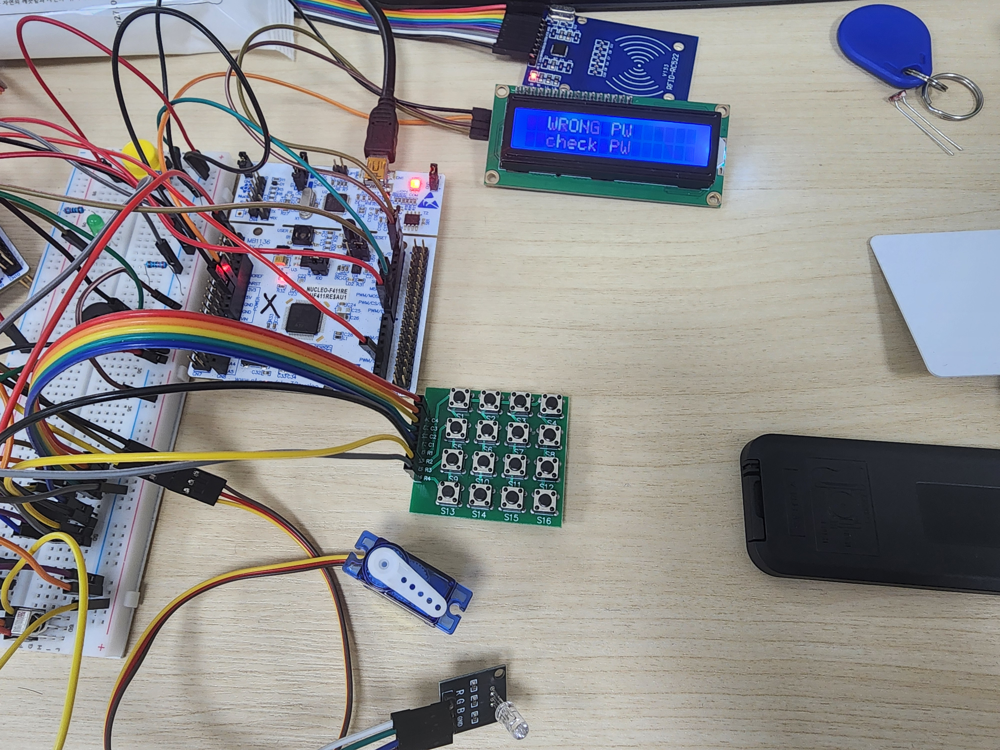

### 5.4 시나리오별 근거와 다음 검증

| 시나리오 | 현재 근거 | 아직 실행하지 않은 확인 |
| --- | --- | --- |
| 정상 비밀번호 | 성공 분기·P05·P07 | 입력부터 도어 구동까지 반복 시간·누락 여부 |
| 오류 비밀번호 | fail 분기·P06 | 1·2·3·4번째 실패의 카운터·화면 순서 |
| 길이 부족 후 # | 소스의 실패 또는 상태 유지 분기 | 각 상태별 실제 입력·LCD·LED 결과 |
| 관리자 변경 | NEW1/NEW2 분기·P03·P04 | 일치·불일치·* 두 번·재확인 지우기 |
| 리셋 후 비밀번호 | RAM 초기 배열 구조 | 변경 후 전원 재인가 결과 기록 |
| 일반·미등록 카드 | Card_Check·P02 | 등록·미등록·짧은 응답·반복 태깅 |
| 원격 잠금·해제 | IR 매핑·P08·P09 | A가 실제 수신한 시각, 자동닫힘 부재, 동시 인증 |
| 정상 UART 프레임 | 송수신 파서·계산 예 | 송신·수신 실측 바이트와 오류 카운터 |
| 손상·과대 LEN 프레임 | 정적 범위 문제 확인 | 경계 검사 보완 후 잘림·LEN·checksum 오류 주입 |
| 장시간 운용 | 현재 반복 시험 로그 없음 | 시험 횟수·주기·전원 조건·실패 기준을 정한 연속 시험 |

후속 검증에서는 시험일, 소스 커밋, 보드 설정, 입력 자극, 기대 결과, 관측 결과, raw log를 함께 저장한다. 표의 미실행 항목은 실제 시험 후 결과와 로그를 채워 관리한다.

## 6 트러블슈팅과 정적 점검

### 6.1 인터페이스 자원 분리와 현재 구성

| 설계 관점 | 현재 구현 | 기술적 의미 |
| --- | --- | --- |
| 키패드와 디버그 UART | 행 PA0·PA1·PA4·PA8, UART2 PA2·PA3 | 행 GPIO가 디버그 TX/RX 핀을 사용하지 않도록 배치 |
| 부저와 A 링크 | 부저 PA9·TIM1, 링크 PC6·PC7·USART6 | 동일 MCU의 PA9에 TIM1_CH2와 USART1_TX를 중복 배치하지 않음 |
| RC522 이벤트 처리 | 메인 루프에서 UID 조회, RC522 상태 레지스터 polling | MCU 외부 IRQ 입력에 의존하지 않는 현재 읽기 구조 |
| 타이머 용도 | TIM1 부저, TIM2 IR, TIM3 서보, TIM4 부저 길이, TIM5 장치 지연 | 서로 다른 출력·측정 목적의 timer 레지스터 설정 분리 |
| 링크와 표시 | 수신 파서가 패킷을 완성하고 Main이 LCD 갱신 | 바이트 수신과 화면 처리를 다른 실행 경로에 배치 |
| 보드별 구현 선택 | BOARD_A·BOARD_B 조건부 컴파일 | 하나의 소스 묶음으로 역할이 다른 펌웨어 생성 |

핀은 기능 이름만 연결하는 것이 아니라 같은 MCU의 대체 기능 사용까지 함께 검토해야 한다. 예를 들어 PA9는 USART1 TX 또는 TIM1_CH2를 선택할 수 있으므로 A에서는 TIM1 부저에 배정하고 링크를 USART6로 옮겨 배치한다. B의 PA9는 별도 MCU이므로 USART1 TX로 사용한다. 키패드 행 배열도 UART2의 PA2·PA3을 피하는 구성이다. 근거: key.c:L13-L31, uart.c:L14-L18, timer.c:L136-L146, uart_link.c:L22-L47.

타이머와 수신 경로를 나누면 개별 기능의 초기화·호출 관계를 설명하기 쉬워진다. 그러나 자원 분리만으로 동시 실행이 보장되는 것은 아니다. LCD·SPI polling과 부저 길이·키 해제 대기가 Main을 점유하므로, 연속 이벤트 처리에는 별도의 스케줄링과 큐 정책이 필요하다. 현재 코드의 장점과 후속 개선을 이 경계에서 구분한다. 근거: timer.c:L116-L133, timer.c:L165-L180, uart_link.c:L106-L115, main.c:L245-L264.

### 6.2 현재 소스에서 확인한 주요 잔존 문제

| ID | 문제 | 근거 위치 | 영향과 우선 보완 |
| --- | --- | --- | --- |
| R01 | UART LEN 상한 없음 | uart_link.c L88-112 | 임시·최종 버퍼 범위 초과. 저장 전 상한·명령 길이 검사 |
| R02 | 프레임 timeout·resync 불충분 | uart_link.c L72-118 | 잘린 프레임 후 수신 상태 잔류. 시간 제한과 재동기화 정책 |
| R03 | 단일 패킷·IR 완료 슬롯 | uart_link.c L107, ir.c L54 | Main 지연 중 연속 이벤트 누락. 큐와 overflow 정책 |
| R04 | 클록 상수 혼재 | clock.c L11-16, uart_link.c L40, lcd.c L23-25 | baud·I2C 설정 불일치. 단일 PCLK 계산과 실제 계측 |
| R05 | 비밀번호 평문 전달·로그 | main.c L180, L339 | 변경 값 노출. 이벤트만 전송하고 로그 제거 또는 마스킹 |
| R06 | RAM 비밀번호·UID 비교 | main.c L17-25, L73-82, L177 | 지속성·인증 강도 한계. 자격정보 저장·인증 정책 재설계 |
| R07 | 실패 시간 잠금 없음 | main.c L127-133 | 세 번째 이후 계속 시도 가능. 요구사항에 따른 잠금 상태 |
| R08 | blocking I/O와 긴 루프 | main.c L121, L183, L238, L252, L352 | 이벤트 처리 지연. 기한 기반 상태와 비동기 처리 |
| R09 | anticollision 최소 길이 검사 없음 | rfid.c L169-173 | 짧은 응답 해석 위험. 단계별 기대 길이 검사 |
| R10 | 문서·선언의 잔존 불일치 | device_driver.h L6, Makefile L11 | 유지보수 오해. 현행 배열·옵션을 기준으로 정리 |

버퍼 경계와 평문 정보 노출은 인증 장치의 입력 검증과 정보 관리에 직접 영향을 주므로 우선 보완한다. 위 목록은 복원된 코드에서 도출한 정적 개선 과제이며 수정 적용 여부는 후속 변경 이력으로 관리한다.

### 6.3 권장 수정 설계와 완료 기준

첫째, UART는 LEN을 받는 단계에서 허용 상한을 확인하고 명령별 고정 길이를 검사한다. 이 프로젝트의 현재 명령 중 가장 긴 payload는 UID 4바이트이므로 명령 테이블을 검증 기준으로 사용할 수 있다. 길이가 맞지 않으면 payload를 해석하지 않고 오류 카운터와 초기 상태로 이동한다. 그 다음 수신 timeout, checksum 실패 시 처리, 연속 STX, 알려지지 않은 명령 정책을 명시한다. 이는 개선 설계이며 현재 코드가 아니다.

둘째, 클록 값을 한 곳에서 계산하고 UART·I2C·Timer가 해당 값을 참조하도록 한다. SystemCoreClock을 활용하려면 실제 클록 변경 후 갱신 함수 호출도 연결해야 한다. 현재 애플리케이션은 option.h의 상수를 사용하며 SystemCoreClock 변수는 초기 16 MHz 상태로 남을 수 있다. 변수를 다른 라이브러리가 사용하기 시작할 때 발생할 혼선을 예방하려면 어느 계산 체계를 기준으로 삼을지 정해야 한다. 근거: system_stm32f4xx.c:L137-L137, main.c:L34-L41, option.h:L1-L5.

셋째, 도어 유지 시간과 부저·LED 패턴을 기한 기반 상태로 바꾸어 Main이 계속 통신·입력을 처리하도록 한다. 새 구조에서는 LOCK 명령과 인증 성공·해제 유지 시간이 충돌할 때 무엇이 우선인지 정한다. 큐를 추가할 경우 크기뿐 아니라 overflow 시 오래된 이벤트를 버릴지, 새 이벤트를 거절할지, 오류를 기록할지도 결정한다.

넷째, 비밀번호 변경 이벤트는 값 자체 대신 변경 완료 여부만 전달하도록 설계한다. 비휘발성 저장은 단순 Flash write뿐 아니라 쓰기 도중 전원 차단, 초기값 복구, 값 유효성 확인을 포함해야 한다. 카드 UID 비교와 고정 IR 코드도 실제 운영 요구에 맞는 인증 방식으로 재검토한다.

## 7 성과와 한계

### 7.1 코드와 산출물로 설명할 수 있는 성과

첫 번째 성과는 개별 주변장치를 하나의 인증 흐름으로 연결한 것이다. 키패드 EXTI 이벤트를 메인 상태 처리와 연결하고, SPI로 읽은 카드 UID를 권한 분기에 사용했으며, 처리 결과를 PWM·GPIO·부저로 표현했다. 두 번째는 관리 화면을 다른 MCU로 분리하고 프레임과 명령 테이블을 통해 상태를 전달한 것이다. 세 번째는 같은 소스 묶음에서 두 보드 이미지를 구분하는 빌드 구조를 만들고 현재 환경에서 재생성할 수 있음을 확인한 것이다.

이 경험은 MCU의 핀 대체 기능, 주변 클록, interrupt pending과 애플리케이션 이벤트, 프레임 경계와 payload 길이가 함께 맞아야 시스템이 동작한다는 점을 설명하는 근거가 된다.

### 7.2 결과의 범위

현재 확인한 것은 소스 구현, 최종 사진의 상태 표시, 9/12의 재빌드이다. 실제 UART·I2C 속도, 서보 각도 오차, 인증 처리 지연, 동시 이벤트 처리율, 장시간 오류율, 전원 안정성, 내구성은 측정하지 않았다. 교육용 프로토타입의 기능 통합과 운영 환경의 보안·신뢰성 검증을 구분한다.


## 8 개선 방향과 결론

| 단계 | 수행할 작업 | 완료를 판단할 자료 |
| --- | --- | --- |
| 1 | LEN·명령 길이 검사, 평문 값 전달 최소화 | 수정 diff, 정상·비정상 입력별 단위 시험, 미노출 로그 |
| 2 | 클록 계산 통일과 파형 측정 | UART baud·I2C SCL·PWM period/duty 캡처와 설정 비교 |
| 3 | 프레임 timeout·queue·비블로킹 상태 | 잘린 프레임·연속 명령·동시 입력의 기대/실제 결과 |
| 4 | 인증·재시도 제한·비휘발성 저장 정책 | 전원 재인가·쓰기 중단·잘못된 인증의 복구 결과 |
| 5 | 전원·기구·장시간 시험 | 장치 조건, 반복 횟수, 실패 기준, 원시 계측 로그 |

STM32 2 Board 스마트 도어락은 인증과 관리 콘솔을 분리하고, 여러 주변장치를 레지스터 수준에서 통합한 프로젝트이다. 보존 소스와 시연 자료로 기능 흐름을 설명할 수 있으며, 공개용 사본을 현재 도구에서 재빌드했다. 현재의 한계는 클록 설정의 일관성, 수신 프레임 검증, 정보 노출, 비동기 처리와 실제 계측의 부족에 있다. 다음 단계는 이 항목을 구현과 시험 기록으로 차례로 검증하는 것이다.

## 부록 A 빌드와 메모리 상세

링커는 ROM을 0x08000000에서 512 KiB, RAM을 0x20000000에서 128 KiB로 정의한다. .text의 앞에 crt0.o를 두어 벡터 테이블·시작 코드를 배치하고, .rodata 뒤의 ROM 위치를 .data의 load 주소로 사용한다. .data와 .bss는 RAM에 배치된다. 시작 코드는 이 심볼을 이용해 초기 데이터를 복사하고 BSS를 지운다. 근거: rom_0x08000000.lds:L1-L64, crt0.s:L338-L366.

runtime.c의 _write는 printf 출력을 USART2 송신 함수로 전달하고, _read 등은 최소 stub을 제공한다. _sbrk는 __ZI_LIMIT__ 이후를 8바이트 정렬해 힙으로 잡고 option.h의 4 KiB 제한을 사용한다.  시작 스택 주소와 option.h의 STACK_BASE 관련 계산은 별개이며 실제 초기 MSP는 벡터 테이블 값을 따른다. 근거: runtime.c:L6-L33, option.h:L7-L14, crt0.s:L7-L8.

| 산출물 | BOARD_A 공개 사본 | BOARD_B 공개 사본 |
| --- | --- | --- |
| BIN SHA256 | 86ea257e956bd5903536768624f9abc26489826c4abc69c2b1af7a891cd44d95 | 8986eaab0628c79bb64c698457f51869d1f4ab1d880cd583d8b69c9a9e5f2276 |
| 실행 날짜 | 2026.09.12 | 2026.09.12 |
| 빌드 매크로 | BOARD_A | BOARD_B |
| 장치 플래싱 | 수행하지 않음 | 수행하지 않음 |

-g 빌드에는 경로 정보가 들어갈 수 있어 다른 디렉터리의 ELF hash가 달라질 수 있다. 이 표의 BIN hash는 이번 산출물을 식별하는 값이며 모든 환경에서 동일한 ELF를 보장한다는 선언이 아니다.

## 부록 B 출처와 공개 범위

1. 정광근 최종산출물 260723-260727_Cortex-M4.zip과 원본 README·USER_MANUAL·사진. 원본 자료의 민감 인증 값은 공개 문서에 재현하지 않았다.
2. 별도 보존 source_snapshot_0722_project_test. 원본 28개 소스 구성 파일을 확인하고 공개용 main.c의 자격 값만 예제로 교체했다.
3. 공개 펌웨어 기준 커밋 6f61e50f07a67b1043a8b24093537f52cacf18ec. 파일 행 번호는 이 커밋의 firmware 경로를 기준으로 한다. 
4. docs/build-results.json, build-board-a.log, build-board-b.log. 2026.09.12 현재 실행한 컴파일·링크·BIN 생성의 근거이다.
6. STMicroelectronics RM0383. SPI BR divider 및 I2C CCR 등의 레지스터 수식 해석 보조 자료.  https://www.st.com/resource/en/reference_manual/rm0383-stm32f411xce-advanced-armbased-32bit-mcus-stmicroelectronics.pdf
7. NXP MFRC522 datasheet. 호스트 SPI와 레지스터 통신 형식의 해석 보조 자료.  https://www.nxp.com/docs/en/data-sheet/MFRC522.pdf
